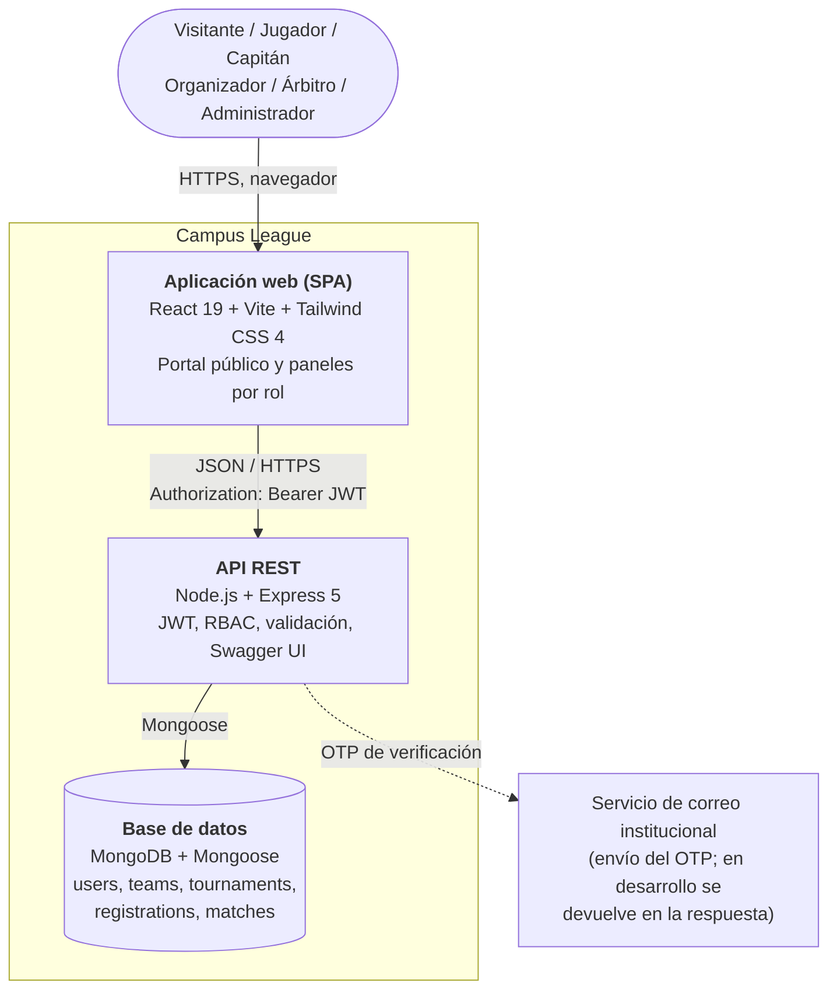

# Diagrama C4 nivel 2: Contenedores

```mermaid
flowchart TB
    visitante(["Visitante / Jugador / Capitán<br/>Organizador / Árbitro / Administrador"])

    subgraph sistema["Campus League"]
        spa["<b>Aplicación web (SPA)</b><br/>React 19 + Vite + Tailwind CSS 4<br/>Portal público y paneles por rol"]
        api["<b>API REST</b><br/>Node.js + Express 5<br/>JWT, RBAC, validación, Swagger UI"]
        db[("<b>Base de datos</b><br/>MongoDB + Mongoose<br/>users, teams, tournaments,<br/>registrations, matches")]
    end

    correo["Servicio de correo institucional<br/>(envío del OTP; en desarrollo se<br/>devuelve en la respuesta)"]

    visitante -->|"HTTPS, navegador"| spa
    spa -->|"JSON / HTTPS<br/>Authorization: Bearer JWT"| api
    api -->|"Mongoose"| db
    api -.->|"OTP de verificación"| correo
```
