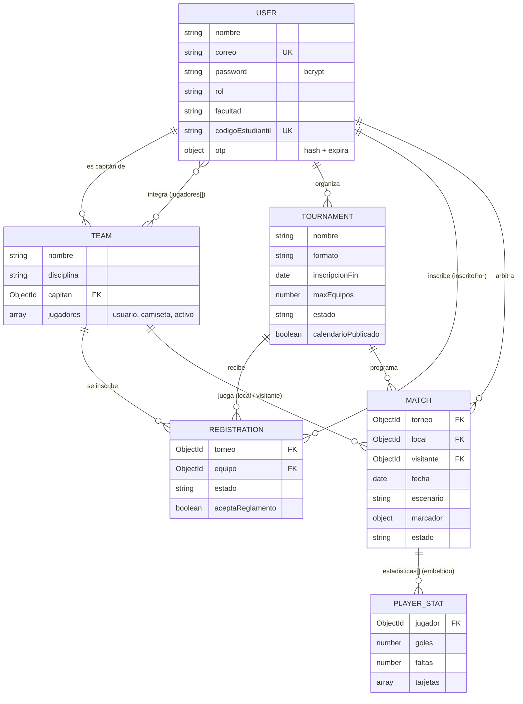

# Modelo de datos (MongoDB / Mongoose)

```mermaid
erDiagram
    USER ||--o{ TEAM : "es capitán de"
    USER }o--o{ TEAM : "integra (jugadores[])"
    USER ||--o{ TOURNAMENT : "organiza"
    TEAM ||--o{ REGISTRATION : "se inscribe"
    TOURNAMENT ||--o{ REGISTRATION : "recibe"
    USER ||--o{ REGISTRATION : "inscribe (inscritoPor)"
    TOURNAMENT ||--o{ MATCH : "programa"
    TEAM ||--o{ MATCH : "juega (local / visitante)"
    USER ||--o{ MATCH : "arbitra"
    MATCH ||--o{ PLAYER_STAT : "estadisticas[] (embebido)"

    USER {
        string nombre
        string correo UK
        string password "bcrypt"
        string rol
        string facultad
        string codigoEstudiantil UK
        object otp "hash + expira"
    }
    TEAM {
        string nombre
        string disciplina
        ObjectId capitan FK
        array jugadores "usuario, camiseta, activo"
    }
    TOURNAMENT {
        string nombre
        string formato
        date inscripcionFin
        number maxEquipos
        string estado
        boolean calendarioPublicado
    }
    REGISTRATION {
        ObjectId torneo FK
        ObjectId equipo FK
        string estado
        boolean aceptaReglamento
    }
    MATCH {
        ObjectId torneo FK
        ObjectId local FK
        ObjectId visitante FK
        date fecha
        string escenario
        object marcador
        string estado
    }
    PLAYER_STAT {
        ObjectId jugador FK
        number goles
        number faltas
        array tarjetas
    }
```
