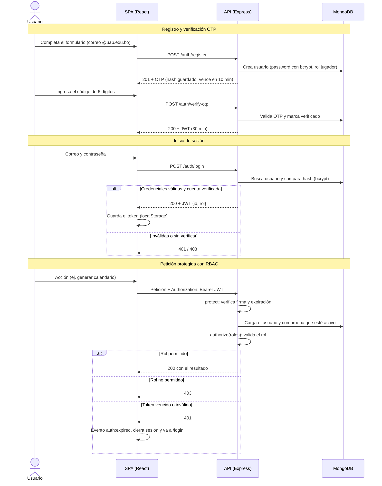

# Diagrama de secuencia: autenticación JWT

```mermaid
sequenceDiagram
    actor U as Usuario
    participant S as SPA (React)
    participant A as API (Express)
    participant D as MongoDB

    Note over U,D: Registro y verificación OTP
    U->>S: Completa el formulario (correo @uab.edu.bo)
    S->>A: POST /auth/register
    A->>D: Crea usuario (password con bcrypt, rol jugador)
    A-->>S: 201 + OTP (hash guardado, vence en 10 min)
    U->>S: Ingresa el código de 6 dígitos
    S->>A: POST /auth/verify-otp
    A->>D: Valida OTP y marca verificado
    A-->>S: 200 + JWT (30 min)

    Note over U,D: Inicio de sesión
    U->>S: Correo y contraseña
    S->>A: POST /auth/login
    A->>D: Busca usuario y compara hash (bcrypt)
    alt Credenciales válidas y cuenta verificada
        A-->>S: 200 + JWT {id, rol}
        S->>S: Guarda el token (localStorage)
    else Inválidas o sin verificar
        A-->>S: 401 / 403
    end

    Note over U,D: Petición protegida con RBAC
    U->>S: Acción (ej. generar calendario)
    S->>A: Petición + Authorization: Bearer JWT
    A->>A: protect: verifica firma y expiración
    A->>D: Carga el usuario y comprueba que esté activo
    A->>A: authorize(roles): valida el rol
    alt Rol permitido
        A-->>S: 200 con el resultado
    else Rol no permitido
        A-->>S: 403
    else Token vencido o inválido
        A-->>S: 401
        S->>S: Evento auth:expired, cierra sesión y va a /login
    end
```
